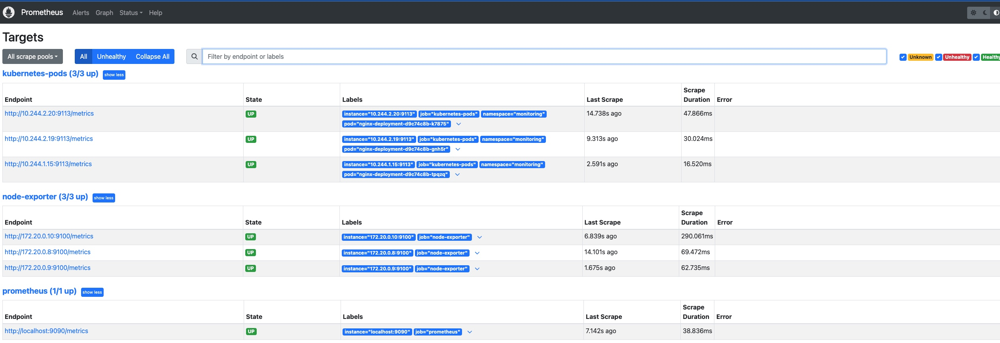

## 📘 Kubernetes + Nginx + Prometheus (k8s-nginx-prometheus)

1️⃣ Create a kind cluster

```bash
kind create cluster --name k8s-demo --config kind-cluster.yaml
kubectl cluster-info
```

Kubernetes uses a kubeconfig (usually ~/.kube/config) to know:

which cluster to talk to
which credentials to use
which namespace is default

👉 You can have multiple clusters:

kind-k8s-demo → local Kind cluster
minikube → local Minikube
gke-project-cluster → GKE
eks-dev → AWS EKS

Switch clusters:
```bash
kubectl config get-contexts
kubectl config use-context kind-k8s-demo
```
 2️⃣ Why we need exporters

Nginx serves websites (port 80)
It has a status page (/stub_status) → shows raw stats like:

Active connections: 3
Reading: 0 Writing: 1 Waiting: 2

# ❌ But this is not in Prometheus format (Prometheus can’t understand it).

Solution → nginx-exporter
The nginx-exporter is a small helper program (a sidecar container).
It does 2 jobs:

1.Read nginx’s /stub_status on port 80
2.Convert it into Prometheus metrics format and expose it on port 9113
Annotate the pod with prometheus.io/scrape: "true" and prometheus.io/port: "9113".

Example:
Without exporter:
Prometheus → http://nginx:80/stub_status → ❌ can’t parse
With exporter:
Prometheus → http://nginx-exporter:9113/metrics → ✅ gets clean metrics 

🔹 Node Exporter

Runs as a DaemonSet → creates one Pod per Node in your cluster.
Each pod is separate, not part of your nginx app.
It exposes system-level metrics (CPU, RAM, disk, network).
Always listens on port 9100.

Example:
node-exporter-ln4nj   (runs on worker1)
node-exporter-t4bsq   (runs on worker2)
node-exporter-xdhss   (runs on control-plane)

Here’s what happens step by step:
Node Exporter Pod runs on each node → listens on port 9100.
Example: http://10.244.1.5:9100/metrics
Prometheus (the server) knows from its config (ConfigMap) that:
“Hey, scrape node-exporter targets on port 9100.”
Prometheus goes to each Node Exporter pod’s IP:9100 and collects the metrics.
Prometheus stores those metrics in its time-series database.
When you open the Prometheus UI on port 9090, you can:
Query those metrics with PromQL (node_cpu_seconds_total, node_memory_Active_bytes, etc.)

3️⃣ The big picture

Node Exporter = watches your VM/Node health (CPU, RAM, disk).
👉 It always shows its metrics on port 9100.

Nginx Exporter = watches your nginx app health (connections, requests).
👉 It converts nginx’s /stub_status into Prometheus format.
👉 It shows metrics on port 9113.

Prometheus = collects metrics from both exporters.
👉 Its web UI is on port 9090.


4️⃣ Prometheus setup

Why Prometheus needs a ServiceAccount?
Prometheus doesn’t just scrape fixed IPs.
It uses Kubernetes service discovery to automatically find:

Pods
Services
Endpoints
Nodes

To do that, Prometheus must ask the Kubernetes API:
“Hey, show me all Pods with annotation prometheus.io/scrape=true.”
Annotations are metadata. Kubernetes ignores them, but Prometheus uses them.

But 👉 the Kubernetes API is secure. You can’t just read Pod info without permission.

How Prometheus gets permission?
ServiceAccount → identity for Prometheus Pod (“this is who I am”).
ClusterRole → defines what that identity is allowed to do (read pods, nodes, services, etc.).
ClusterRoleBinding → links the ServiceAccount to the ClusterRole.
Without RBAC
Prometheus could start, but it wouldn’t see any Pods or Endpoints.
On the UI, you’d only see Prometheus itself as a target.

## 🎯 Summary

Nginx: serves site on port 80 → /stub_status enabled → sidecar exporter re-exposes metrics on 9113.

Node Exporter: DaemonSet, per-node system metrics on 9100.

Prometheus: Deployment on 9090, scrapes exporters using annotations + service discovery.

RBAC: lets Prometheus query Kubernetes API to discover pods/services.

Prometheus yaml file(ConfigMap): holds scrape jobs (what to scrape).

👉 Result: You get both node health and nginx app health metrics in one place: Prometheus.

Here is a screenshot of Prometheus Targets page:

